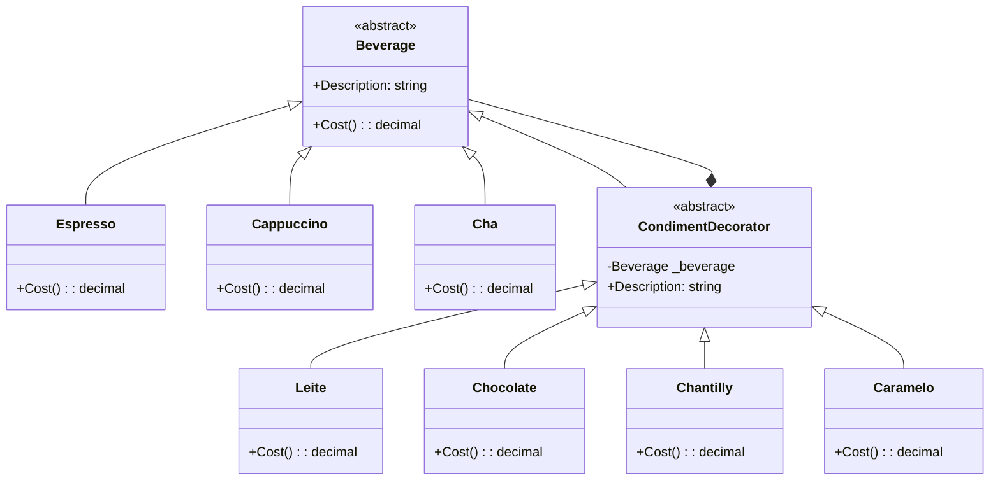

## 🥁 CarnaCode 2026 - Desafio 09 - Decorator

Oi, eu sou o Ronaldo e este é o espaço onde compartilho minha jornada de aprendizado durante o desafio **CarnaCode 2026**, realizado pelo [balta.io](https://balta.io). 👻

Aqui você vai encontrar projetos, exercícios e códigos que estou desenvolvendo durante o desafio. O objetivo é colocar a mão na massa, testar ideias e registrar minha evolução no mundo da tecnologia.

### Sobre este desafio
No desafio **Decorator** eu tive que resolver um problema real implementando o **Design Pattern** em questão.
Neste processo eu aprendi:
* ✅ Boas Práticas de Software
* ✅ Código Limpo
* ✅ SOLID
* ✅ Design Patterns (Padrões de Projeto)

## Problema
Uma cafeteria oferece bebidas base (Café, Cappuccino, Chá) e múltiplos complementos (Leite, Chocolate, Chantilly, Caramelo). O código atual cria uma classe para cada combinação possível, resultando em explosão de classes e código duplicado.

## Solução (Decorator Pattern)
Para resolver a explosão de classes, utilizei o **Decorator Pattern**:
*   **Componente (`Beverage`)**: Classe base abstrata para todas as bebidas.
*   **Decorador (`CondimentDecorator`)**: Classe abstrata que herda de `Beverage` e encapsula uma instância de `Beverage`.
*   **Componentes Concretos**: `Espresso`, `Cappuccino`, `Cha`.
*   **Decoradores Concretos**: `Leite`, `Chocolate`, `Chantilly`, `Caramelo`.


### Diagrama de Classes


### Estrutura do Projeto
```
balta-desafio-carnacode-2026_9-decorator/
├── src/
│   ├── Beverage.cs             # Componente Abstrato
│   ├── Challenge.cs            # Código Legado (Demonstração do Problema)
│   ├── ConcreteBeverages.cs    # Componentes Concretos (Espresso, etc.)
│   ├── ConcreteDecorators.cs   # Decoradores Concretos (Leite, etc.)
│   ├── CondimentDecorator.cs   # Decorador Base
│   └── Program.cs              # Novo Ponto de Entrada (Menu)
├── balta-desafio-carnacode-2026_9-decorator.csproj
└── README.md
```

### Etapas da Refatoração
1.  **Análise**: Identifiquei a "explosão de classes" causada pela herança excessiva.
2.  **Infraestrutura**: Criei o arquivo de projeto `.csproj` (Target .NET 10) para possibilitar a execução.
3.  **Coexistência**: Renomeei a classe `Program` original para `LegacyProgram` para manter o código antigo acessível.
4.  **Abstração**: Criei a classe base `Beverage` e o decorador base `CondimentDecorator`.
5.  **Implementação**: Refatorei as bebidas (`Espresso`, etc.) e criei os decoradores como classes separadas (`Leite`, `Chocolate`).
6.  **Integração**: Criei um novo `Program.cs` que permite ao usuário escolher qual versão executar.

Dessa forma, é possível combinar qualquer bebida com quaisquer complementos dinamicamente, sem criar novas classes para cada combinação.

### Como Executar
O projeto permite executar tanto a versão legada quanto a refatorada:
1.  Execute `dotnet run`
2.  Escolha a opção:
    *   `1`: Versão Legada (Demonstração do problema)
    *   `2`: Versão Refatorada (Solução com Decorator)

## Sobre o CarnaCode 2026
O desafio **CarnaCode 2026** consiste em implementar todos os 23 padrões de projeto (Design Patterns) em cenários reais. Durante os 23 desafios desta jornada, os participantes são submetidos ao aprendizado e prática na idetinficação de códigos não escaláveis e na solução de problemas utilizando padrões de mercado.

### eBook - Fundamentos dos Design Patterns
Minha principal fonte de conhecimento durante o desafio foi o eBook gratuito [Fundamentos dos Design Patterns](https://lp.balta.io/ebook-fundamentos-design-patterns).

### Veja meu progresso no desafio
[Repositório Central](https://github.com/ronaldofas/balta-desafio-carnacode-2026-central)
